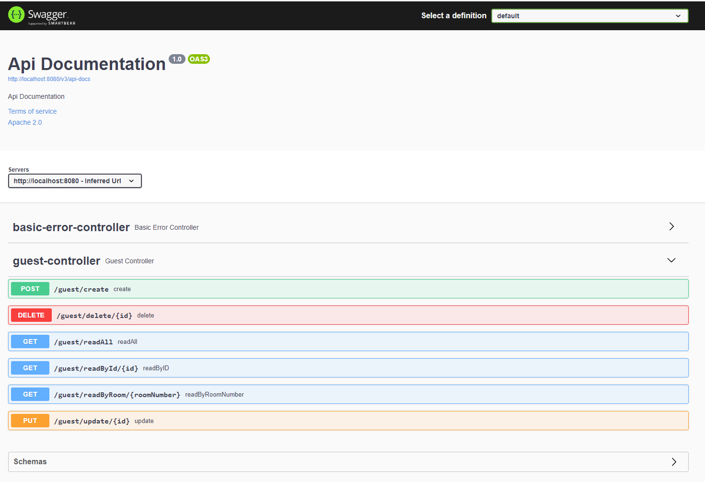

# Hotel-Project
Context of a Hotel intranet, with an API providing  CRUD functionality for guests.

Why are we doing this?

This project has been created as a mock project to be assessed and marked as part of our QA Bootcamp; the deliverables picked have been chosen to prove capabilities in specific areas, particularly the ability to build a Spring Project independently.

The propject has been created therefore in the context of a Hotel Intranet, with the CRUD functionality created with the intention of allowing Hotel Employees, to access and manipulate persistent guest data stored on a database.

The data has been stored in local host currently to imitate the hosting of a persistence database, however the functionality in regards to the rest API, for example use of POST and GET mapping are applicable and transferable, which is why it was conducted as so.

This project then offers me the ability to persue with personal developement once this stage is complete, by adding increased functionality in my own time, for example the inclusion of Bookings, Check In and Check Out, and more in-depth functionality and inner workings, allowing me to practice and explore more solutions.

The project would also allow me to explore personal developement in terms of the front end, using the Hotel Project context create a fully stacked project demonstratabe to employers, using HTML, CSS or potentially .NET. These are compitencies I would like to experience before moving forward with my career, and it would give me an good understanding of the back end and how it all links together. I imagine Spring has more useful tools to help towards this.

What went well?

The creation of the first steps of the project using spring went more smootly than I imagined; although i did not see myself having many issues, it is easy to make mistakes and when creating the Spring Boot App and coding the application settings properties files, I only faced one issue being miss-spelled filenames. I did not face any fatal errors that I have been aware of which could of occurred with improper setup.

the creation of the Controller, Service and Repo classes went well, particularly the journey these files took when being altered to to interact with each other, all went more smoothly than I imagined. I did not face many hurdles and the errors faced were easy to resolve, meaning the project progressed smoothly through these stages.

I also found the use of the JIRA board to be helpful in upholding progress, by allowing me to focus on specific tasks and break workloads down, instead of facing them in big chunks. This can be seen from the addittion to more detailed tasks later on as the project progressed, I broke down tasks into steps to allow myself the focus adn assurance that the next task has been preplanned.

Swagger was added without any issues, except I was not aware of the Basic Error Controller, and assumed I had an error instead of this being what handles errors.

What didn't go as planned?

Story points became clearer as the project went on but I found myself wanting to alter previously given story point estimates after progressing further. upon reflecting on this I don't think I have used story points to the fullest of their potential, and felt that they didn't actually allow me to provide accurat resource time should it be required.

JIRA Backlog items; trying to write up an entire plan for the project from start to finish based on the notes I had taken were too broad, so when starting new areas of the project, I found I had to create new backlog items for tasks needed. This stems from a lack of understanding in depth of the exact process I was going to take, and 

I was getting anxious about starting after the planning of this took an entire day due to that gap in understanding, as it meant I would have to revise in-depth each step to plan exact steps and at the time this seemed like a waste of resources.

With the writing of certain methods and functions, I found that you would have to code the lines piece by piece, otherwise you would face issues with imports not prompting correctly and such. For example you will have to write schema and test crosspath, you have to write out till ...ExecutionPhase. 	and then select the method, rather than hard coding. Having to import the imports manually would create issues if not expecting an import and hitting errors such as 'cannot be resolved as variable'.

I also found it challenging not only to stipulate when variables had to be called certain names, for example in Test Controller: Mvc, Mapper, output... but it is hard to tell when things have to be named certain ways for dependencies etc.. or if we can call them what we like. 
I then however also felt compelled to change variable names, as writing up the same variable names as the example we were taugh almost seemed like plagerism, but in most cases the names given were the most suitable, especially in terms of reflection at a later date from myself or an potential employer.

The use of Git Branches and merge / pulling; I implemented the pull request into Main not Dev, and lost progress on dev and pushed functionality to main also by accident. This resulted in me having to restart the whole process and readd files manually; I have however gained knowledge in the use of pull requests from Branches.

Custom Queries were an area I felt would be easy to regain any lost marks through stretch goals, however although most functionality was likely coded right, I could not get findByFirstNameAndLastName to work; it was not possible to proceed with this due to time contraints. Instead i focused resources on an easier query, findbyRoomNumber; as this was only one input, I could use @PathVariable, and this worked first time without issues when coded.

Possible improvements for future revisions of the project.

I would put more time into in-depth planning using the JIRA backlog at the start, making sure the plan is entirely finished in-detail instead of relying on filling details when they became clear later.
More focus on principles like Single Responsibility and practice them more to understand when to incorperate them; the principles we learned are definetely relevant but some of them will take practice to enact under pressue.
Next time, particularly under a different context, I would like to explore other approaches to things more, for example despite understanding why we need to Entity - Controller - Service - Repo format, I would like to explore other options to be able to see exactly how everything should work individually and learn when things are needed to be introduced.
I would also be keen to explore independently found solutions to issues more, as would be the case in a real employement situation; as opposed to relying on the trainer for help with issues, knowing other people in the class have also faced the same issue. This isn't an issue with this projects structure, it serves great to the purpose of educating on problem solving etc at this stage; but the next stage would definetely be more independent focused.

Screenshots showing your postman requests and the output from the API.

This has been done at all levels, but for the purpose of covering all basis, I will demonstrate at the repo level.

Create:

Read All:

Read By ID:

Update:

Delete:

Screenshots of your database to prove that data is being persisted.

Screenshot of your test results, including coverage report.

Coverage:

Swagger (in Documentation as requested):

Link to Jira Board. 
https://charles-smith.atlassian.net/jira/software/projects/DP/boards/3
